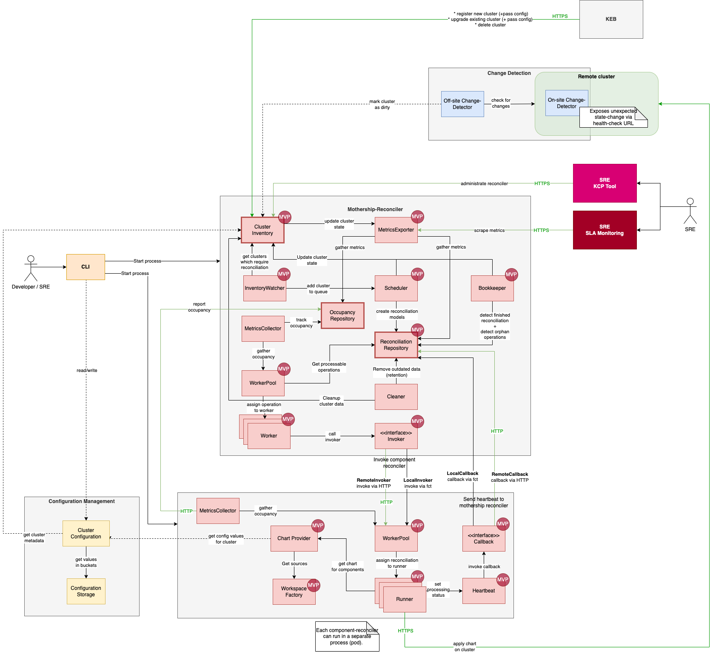

# Reconciler

# 1. Introduction and Goals

With the Kyma 2.0 release, the lifecycle management of a Kyma installation is centralised in a dedicated reconciler component.

Goal of the reconciler is to install, update, and delete Kyma installations.

Besides managing the lifecycle, the reconciler is also responsible for reverting unexpected changes applied on Kyma-managed resources in Kubernetes. This is especially relevant since Kyma 2.0, which allows customers to have full admin access to the cluster or to bring their own cluster.

## 1.1 Requirements Overview

Non-functional requirements are:

* Reconciliation must be lightweight, fast, and easy scalable.
* Focus of the reconciler is on the lifecycle management of Kyma related components (it is not required to support everything)
* Product has to expose monitoring metrics and log data and be integrated into the existing observability stack.
* Administration interface (e.g. console) exists abd can be used by / embedded in existing administrative tools.
* Log messages have to be expressive and reconciliation related logs have to allow a correlation to the cluster they belong to.

## 1.2 Quality goals

Top five main quality goals are:

|Priority|Goal|Scenario|
|---|---|---|
|1|Reliability|95% of all reconciliations are successful (excluded are infrastructure or Kyma component specific issues).|
|2|Performance efficient|A component reconciliation does not take longer than a common HELM deployment. The overall system performance is regularly measured by load tests.|
|3|Operability|System operability is verified by operational test cases. Continuous improvement cycles are established and operational quality gaps are addressed in reoccurring retrospectives.|
|4|Security|The software is continuously verified for potential vulnerabilities and compliant with SAP security standards|
|5|Maintainability|CI/CD pipelines are established and the code quality is regularly measured. Code smells are tracked and refactorings happen regularly|

## 1.3 Stakeholder

|Stakeholder|Expectations|
|---|---|
|Product Management|Ensure fast and stable Kyma installations and ensure SLAs for managed Kyma clusters.|
|SRE|Reduction of efforts by automated health and recovery functionality for managed Kyma clusters. Operability of the reconciler is simple and widely automated.|
|Kyma component developers|Simple way to provide custom reconciliation logic and easy ways to test the reconciliation of a Kyma component.|
|On-call engineers|Support for efficient analysis of incidents related to Kyma reconciliations or defective Kyma installations.|
|Reconciler team (Jellyfish)|Code base is easy to understand, enhance, and test. Code quality is high (regularly measured), documented and technical debts are regularly removed.|

# 2. Architecture Constraints

This section summarizes requirements that constrain software architects in their freedom of design and implementation decisions or decision about the development process.

* Postgres has to be used as RDBMS system as it is already used in KCP (by KEB)
* The software has to run in K8s clusters (KCP) as pod but also as standalone process (main program).
* It has to be able to use the reconciliation logic within the Kyma CLI.
* Support for introducing component specific reconciliation logic is required.
* Any reconciliation has to behave idempotent.
* Scalability is required and parallel accesses on data (race conditions) is expected.
* Integration into existing observability and security scanner stack in SAP is needed.
* Usage of Kyma CI/CD system (Prow) and reuse/adaption of existing pipelines (if possible).
* Use HELM templating and installation logic as it's a mainstream library but don't use hooks. Also be aware about [its drawbacks](https://banzaicloud.com/blog/helm3-the-good-the-bad-and-the-ugly/).

## 3. Context and Scope

## 3.1 Business context

The reconciler runs in two business contexts:

1. *microservice* inside the KCP ecosystem
2. *embedded* as library into another application (for example, Kyma CLI)

### 3.1.1 Microservice

{diagram}

Within the KCP landscape, the reconciler is running in a microservice setup, which consists of two components:

1. Mothership reconciler

   The mothership reconciler is responsible for coordinating the reconciliation processes applied on Kyma clusters by interacting with the component reconcilers. The mothership reconciler is the leader of all reconciliation-related data.

3. Component reconcilers

   The component reconcilers are responsible for rendering particular Kyma component charts and applying them on Kubernetes clusters. The mothership reconciler is the only client of component reconcilers.

Surrounding services are:

|Neighbour|Purpose|Output|Input|
|---|---|---|---|
|KEB|Notifies the reconciler about new Kyma clusters, clusters that need an update of their Kyma installation, or must be deleted. KEB is the leading system for cluster data.|Cluster data|Reconciliation status|
|KCP CLI|Command line tool used by SRE and on-call engineers to retrieve reconciliation data and trigger administrative actions (for example, disabling the reconciliation for a cluster).|Administrative calls to reconciler API|Reconciliation data and results|
|SRE observability stack|Track monitoring metrics and log data and expose enhanced analysis and debugging possibilities of administrative engineers via dashboards.|-|Monitoring metrics and log-data|
|SAP Audit log|Store critical events triggered on the reconciler by humans or a 3rd party system for analysis and traceability reasons.|-|Critical system events|

### 3.1.2 Embedded

{diagram}

Other applications can reuse the reconciler logic to offer also lifecycle management capabilities for Kyma.

The Kyma CLI is one of the most important consumer of the reconciler and includes its library.

Main difference of the embedded setup compared to micoservices is the missing REST API and a cluster reconciliation happens just once instead in a interval loop.

In the embedded setup, the mothership and component reconcilers interact over Go function calls with each other instead of HTTP REST calls.

## 3.2 Technical context

### 3.2.1 Ingress (Incoming)

The reconciler interfaces (mothership and component reconcilers) are based on REST as it's currently only used by technical clients.

Two OpenAPI specifications are established:

* [Internal API](blob/main/openapi/internal_api.yaml)

  Defines the interface contract between the mothership and the component reconcilers.

* [External API](blob/main/openapi/external_api.yaml)

  Includes the interface contract of the REST API exposed to a 3rd party system (for example, KEB, KCP CLI etc.) by the mothership reconciler. Most of the communication between the mothership reconciler and 3rd party systems is based on a pull approach: The external system asks the reconciler for particular data or triggers an action.

### 3.2.2 Egress (Outgoing)

No reconciler initiates a communication to an external system. Outgoing communication happens just between the mothership and component reconciler:

* The mothership calls the component reconciler and informs it about a required reconciliation of a Kyma component on a remote cluster.
* The component reconciler replies with a regular heartbeat message to the mothership reconciler about the progress of the requested reconciliation.

# 4. Solution Strategy

## 4.1 Technical decisions

|Decision|Description|Goal|
|---|---|---|
|System design of the mothership reconciler is based on a [data-centered architecture](https://www.tutorialspoint.com/software_architecture_design/data_centered_architecture.htm).|A repository system architecture is an established pattern in Cloud applications because Kubernetes is based on it (ETCD is the data storage and operators are listeners reaching on data changes).|Reuse simple and well-known design principals.|
|Use [event-sourcing pattern](https://martinfowler.com/eaaDev/EventSourcing.html) for storing cluster data|Cluster data must be auditable (all changes must be tracked), and also save against race conditions. For example, an update of the cluster data during an ongoing reconciliation process should still allow us to reproduce the cluster state that was used at the beginning of the reconciliation.|Establish immutable and auditable data records for cluster data.|
|Use [ORM](https://en.wikipedia.org/wiki/Object%E2%80%93relational_mapping) layer for data access|Using ORM libraries for converting the object oriented model to relational managed datasets in a RDBMS is best practise. ORM frameworks in Golang with support for SQLIte and Postgres were quite heavyweight and complex, therefore a custom lightweight ORM optimised for the reconciler use-case is used.|Standardised access to manage object oriented data models in relations data structures.|
|Support multi-instance setup|To scale proportionally, each reconciler must support the execution of multiple instances in parallel. Race conditions must be expected, addressed, and handled by the reconciler accordingly.|Proportional scaling.|

## 4.2. System Decomposition

Following the [single responsibility principle (SRP)](https://en.wikipedia.org/wiki/Single-responsibility_principle), the decomposition of the reconciler happend based on two major concerns:

- A data-leading unit that administrates reconciliation processes

2. An executing unit that assembles and applies Kyma component charts

### 4.2.1 Mothership reconciler

The *mothership reconciler* controls the management of the Kyma clusters, and when and how they must be reconciled. Depending on the configuration of a Kyma cluster, the reconciliation of a Kyma installation consists of multiple Kyma components (normally packaged as [Helm chart](https://helm.sh/docs/topics/charts/)).

The mothership reconciler is responsible for managing all reconciliation-related data and coordinating that Kyma clusters are reconciled either because their configuration was changed, or the last reconciliation was too long ago.

It is a pure management unit, which doesn't interact with any managed Kyma cluster.

### 4.2.2 Component reconciler

Any actions required to apply Kubernetes resources, respectively resources defined within a Kyma component, is handled by so called *component reconcilers*.

The mothership delegates the reconciliation of a particular Kyma component to a component reconciler, which can be either a generalist capable to handle multiple different Kyma components or specialised for reconciling just a particular component.

Component reconcilers take the workload of a reconciliation and have the following characteristics:

* They're stateless.
* They don't need a database.
* They're quickly and easily scalable.

## 4.3 Decisions to achieve quality goals

|Quality goal|Decision|
|---|---|
|Reliability|Daily review of CI/CD pipelines which apply full install and upgrade procedures for Kyma clusters. Issue for re-occuring failures, which seem not to be related to temporary infrastructure issues, have to be raised.|
|Reliability|Also ensure proper reporting of success- and failure-rates via monitoring metrics.|
|Performance efficient|Establish automated load and performance test and execute it regularly in the CI/CD system.|
|Performance efficient| Team receives automatically the test reports and reacts on negative tendencies or unexpected results.|
|Operability|Operational readiness is challenged during retrospectives of incidents.|
|Operability|The operational toolings (for example, KCP CLI or Kitbag) must be enhanced if any required analysis features are missing.|
|Security|Security review for the reconciler product must be passed and regularly repeated.|
|Security|Mandatory security scanner are executed as required quality gate for any reconciler code change. Findings are reviewed during daily team meeting.|
|Security|Any user action must be authenticated and authorized with the company SSO.|
|Security|Critical system actions must be reported to a auditlog system, and must include a reference to the user who applied them.|
|Maintainability|Any potential code smells must be reported by the team members in the daily meeting.|
|Maintainability|Code-smells / code quality gaps have to be tracked in issue tickets, become part of the backlog and the team defines their priority.|

# 5. Building Block View

## 5.1 Whitebox Overall System

|Component|Description|
|---|---|
|KEB|Kyma environment broker coordinates business processes exposed to the BTP cockpit which enables customers to create an SAP managed Kyma runtimes (SKR).|
|Mothership reconciler|Coordinates the lifecycle of Kyma installations on managed Kyma clusters.|
|Component reconciler|Renders and applies Kyma component charts on managed Kyma clusters.|
|KEDA Pod Autoscaler|Horizontal pod autoscaler project which allows a flexible configuration for automated pod scaling.|

## 5.2 Level 1

### 5.2.1 Mothership reconciler

|Component|Description|
|---|---|
|Cluster Inventory|Stores cluster-related data, and offers CRUD operations and lookup functionalities.|
|Scheduler|Queries the cluster inventory for clusters that need a reconciliation, and adds them to the reconciliation queue.|
|Reconciliation Repository|Stores reconciliation-related data, offers CRUD operations, and manages the reconciliation queue.|
|Worker Pool|Queries the reconciliation repository for processable operations.|
|Worker|Runs a reconciliation operation by creating and executing an invoker.|
|Invoker|Calls the component reconciler - either remotely with an REST call or, if running embedded, locally by triggering a component reconciler instance.|
|Bookkeeper|Monitors the progress of cluster reconciliations: It scans for completed cluster reconciliations, detects orphan operations etc.|
|Cleaner|Removes outdated entries from the cluster inventory, shortens change history of clusters etc.|
|Metrics Collector|Tracks monitoring metrics.|
|Occupancy Repository|Stores the occupancy of component reconciler worker pools.|
|Metrics Exporter|Exports monitoring metrics as [Prometheus](https://prometheus.io/) scrape endpoint.|

### 5.2.2 Component reconciler

|Component|Description|
|---|---|
|Worker Pool|Processes a reconciliation operation.|
|Runner|Executes the reconciliation of an operation|
|Chart Provider|Renders the HELM chart of a component.|
|Workspace Factory|Makes HELM charts locally available by downloading them for remote locations (for example, cloud storages, Git repositories etc.)|
|Heartbeat|Triggers the callback to send a reconciliation status of an operation to the mothership reconciler.|
|Callback|Reports the reconciliation status to the mothership (either via REST call or, if running embedded, by executing a callback function).|
|Metrics Exporter|Exports monitoring metrics as [Prometheus](https://prometheus.io/) scrape endpoint.|

# 6. Runtime View

The runtime view shows the most important regularly executed tasks that the mothership reconciler performs, and how the involved software elements are interacting.

|Scenario|Description|
|---|---|
|Receive KEB updates|The KEB service sends cluster updates (such as create, update, or delete) of SKR clusters to the mothership reconciler and pulls the status of the applied change.|
|Report cluster states to SRE|The reconciler exposes several internal metrics (load, processing times etc.) and is scraped by the SRE's managed monitoring system.|
|Enqueue reconciliation|The scheduler regularly checks for clusters that need a reconciliation (for example, because they were updated by KEB or their cluster status wasn't synchronized for a while) and adds them to the reconciliation queue.|
|Process operations|Operations that are ready for processing are picked up by the Worker pool. It communicates them to the particular component reconciler.|
|Reconcile a component|The component reconciler generates the Kubernetes manifest of the component (for example, by rendering a Helm chart) and applies it on a Kubernetes cluster. It regularly checks the progress of the deployed resources (for example, whether they reached the ready state) and reports the progress with heartbeat messages to the mothership reconciler.|
|Bookkeeping|The bookkeeper checks whether a running reconciliation is in a final state (such as finished successfully, or ended with an error state) and updates the cluster status accordingly. Beside that, it checks if any operation hasn't received a heartbeat message for a longer time (for example, because the assigned component reconciler was restarted or gave up) and marks them as orphan operation. Orphan operations will be picked up by the worker pool again.|

# 7. Deployment view

|Service|Description|
|---|---|
|KEB|Microservice coordinating business processes to manage SKR offerings.|
|Postgres DB|Relational database (managed offering from GCP) used by the mothership reconciler and other KCP components like provisioner and KEB.|
|Mothership Reconciler|Microservice coordinating the reconciliation of SKR clusters|
|Component Reconciler|Several microservices reconciling one or more Kyma components.|
|HELM Charts|Source of HELM charts (for example, cloud storages or Git repositories).|
|Kubernetes Cluster|Manage Kubernetes cluster.|
|KCP CLI|Command line tool used to interact with KCP microservices.|
|SRE / On-Call Engineer|Developer or SRE engineer who administrates the KCP microservices.|

# 8. Crosscutting Concepts

## 8.1 Logging

The reconciler follows the recommended approach for [consistent logging in Kyma](https://github.com/kyma-project/community/tree/main/concepts/observability-consistent-logging).

[ZAP library](https://github.com/uber-go/zap) is used and generating log messages. Default output channel is `STDERR`.

## 8.2 Security

The interaction between microservices in KCP is only allowed over secured channels (TLS encrypted connections).

Authentication is also mandatory for any communication; it's ensured by one of the following options:

* mTLS (primarily used for Kubernetes-internal communication between services via the Istio service mesh)
* SSL Key authentication (used when communicating to the Kubernetes cluster)
* Protocol-specific authentication used by the Postgres DB
* OAuth2 (used by the KCP CLI to authenticate developers or SRE engineers)

## 8.3 Monitoring

Monitoring is only needed when the reconciler runs in microservice mode. Because the reconciler is deployed in KCP landscapes, the available Kyma observability stack in KCP is used.

[Custom metrics](https://github.com/kyma-project/community/tree/main/concepts/observability-custom-metrics) are exposed to the central Prometheus monitoring system.

# 9. Architecture Decisions

## 9.1 Relational database as central storage

[Postgres](https://www.postgresql.org/) is already used in KCP by other services (KEB and provisioner).

To avoid adding another storage system, the storage layer of the reconciler also uses Postgres as RDBMS.

## 9.2 Tasks triggered in intervals

Modules in the reconciler architecture are decoupled units with particular responsibilities or tasks, respectively.

Each module has to perform its task regularly and will, for the beginning, be triggered in intervals (using [Go Tickers](https://gobyexample.com/tickers)).

In a later evolution stage, these time based triggers will be replaced by an event-driven approach: a module will be called just in time when it has to perform its task.

## 9.3 Prerequisite components

In Kyma release 1.x, particular components (called "prerequisites") were installed first. Any common Kyma component can expect that these prerequisites are available when it is deployed. 
To avoid major refactoring for Kyma 2.x, the reconciler takes care of this task and installs the prerequisites before common Kyma components are deployed.

Pre-requisites are:

* CRDs
* Component: `cluster essential`
* The Istio component
* Certificates

The list of prerequisite components is defined in the [reconciler configuration](https://github.com/kyma-incubator/reconciler/blob/main/configs/reconciler.yaml#L41-L42).

## 9.4 Software layers

The code structure of the different reconciler modules follows a layered model:

.

Each software layer is allowed to access layers on lower levels, but it is not allowed to access functionalities that are part of a higher layer.

1. Storages

   Persistent data sinks (such as Github, PostgresDB, cloud storages).

2. Persistency

   Abstraction layer to access lower-level data storages.

3. Business model

   Including business models.

4. Repository

   Manages business model entities.

5. Business Components

   Business entities offering enhanced business functions and processes.

6. Endpoints

   Exposed API interfaces (such as HTTP endpoints).

7. Client

   Clients (such as a microservice) accessing exposed API interfaces.

# 10. Risks and Technical Debt

## 10.1 Database

The reconciler uses Postgres to persist business model entities.

### 10.1.1 Custom ORM

Access to the database happens by a custom ORM implementation. This decision was taken to offer optimized access and functionalities to the data structure underneath. This database layer is still in an early state and lacks many features of the common mainstream ORMs (such as [GORM](https://gorm.io/index.html)).

This increases maintenance efforts, introduces potential security risks caused by a lower maturity level, and can reduce the flexibility of the developers caused by missing or incomplete functionalities.

### 10.1.2 Potential performance bottleneck

Any access to data models has to through the ORM and be processed by the RDBMs system. This makes the system to a potential bottleneck which scales proportional and an increasing amount of data can lead to longer query times. Query optimization is, caused by non-optimized data schema structures, challenging and sometimes not possible.

# 11. Glossary

|Acronym|Full name|Description|
|---|---|---|
|SKR|SAP Kyma Runtime|Managed Kyma cluster offering by SAP|
|KCP|Kymca Control Plane|Managing the lifecycle of SKRs|
|KEB|Kyma Environment Broker|Service Broker implementation within BPT, which manages business process related to SKRs.|
|BTP|Business Technology Platform|SAP Cloud offering|

# 12. Appendix

## 12.1 High level overview

