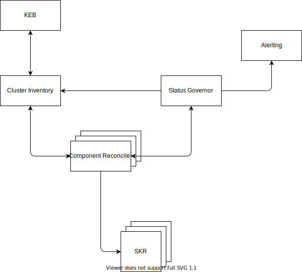

# Reconcilers

## Architecture

### Basic scenario

Each of the SKR components has it own reconciler. It behaves more or less the same as the Operator known from the K8s world. The Component Reconciler fetches the desired state of the component and applies it on the cluster. It can report the status to the Status Governor.

### Calling the reconcilers from Cluster Inventory

We can extend the solution implementing the API on the Reconciler that will allow us to call it from the Cluster Inventory for example to enforce it to do the reconciliation for a particulat cluster.

## Why?

- Each SKR component (set of the components) can be reconciled independently and requires different approaches

- We alredy tried to implement post-installation and pre-installation hooks on different levels and it never wroked witout issues, even with helm.

- Codebase of the reconciler belongs to the team that owns the component as they should know the best how to reconcile it

- One component can have more than one reconciler - easy migrations between versions

- We can scale based on the component complexity or the load. There might be some components that reconciliation takes several secons and some that last miliseconds.

- The implementation is based on the operator pattern known from K8s, but in more centralized manner.

## How?

We will offer base reconciler implementation that will be capable of reconciliation in the simple case (fetch the configuration, apply the configuration, report when done). In the simplies case each team can use this codebase, align the configuration and it should be done.
In more complicated cases our codebase should be used as a boilerplate to build custom reconciler but the comuunication with the Cluster Inventory and SKR should be delivered by our core library.
