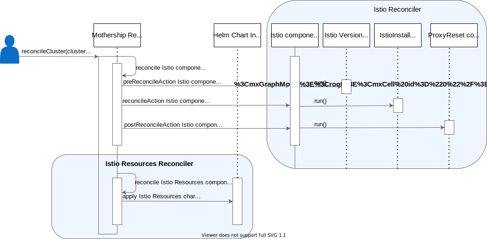
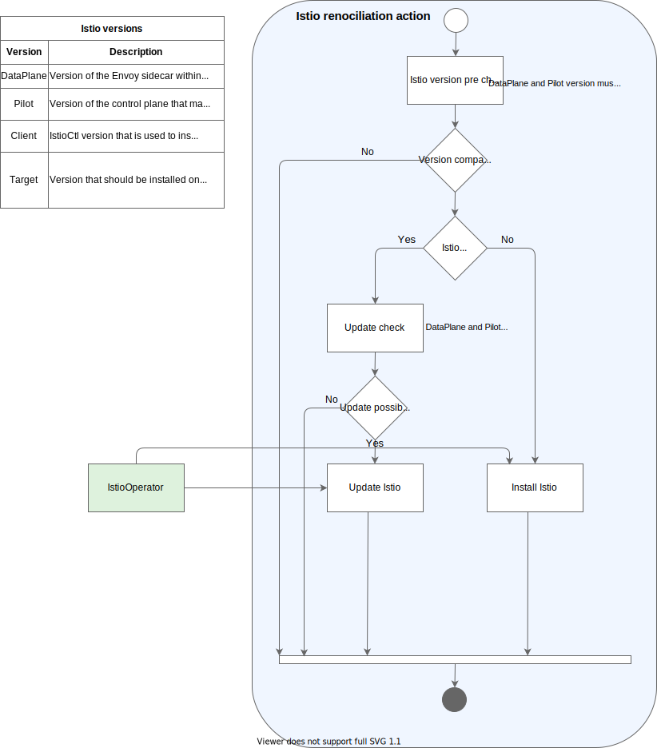

# Istio Reconciler

## Overview

Istio Reconciler manages the [Istio](https://github.com/kyma-project/kyma/tree/main/resources/istio) Kyma component. We support two latest minor Kyma 2.x releases and the `main` Kyma version.

## Prerequisites

The Istio component requires `cluster-essentials` to be installed as a prerequisite.

## Usage

Follow these steps to run Istio Reconciler on your local machine:

1. Export the **KUBECONFIG** variable pointing to your cluster and the **ISTIOCTL_PATH** variable:

   ```bash
   export KUBECONFIG={PATH_TO_THE_KUBECONFIG_FILE}
   export ISTIOCTL_PATH={PATH_TO_THE_ISTIOCTL_BINARY}
   ```

2. Build the Reconciler binary:

   ```bash
   make build-darwin
   ```

3. Pass an appropriate domain name for the two values listed in the command, and run Istio Reconciler:

   ```bash
    ./bin/mothership-darwin local --value global.ingress.domainName=example.com,global.domainName=example.com --components cluster-essentials,istio
   ```

## Details

Reconciliation in Kyma is handled by Reconciler. The Mothership Reconciler knows the reconciliation status of every managed Kyma cluster and initiates reconciliation of all Kyma components.

The reconciliation of Istio is split into two different Kyma components: Istio and Istio Resources. The separation enables having the pure installation process of Istio under control via Istio Reconciler implementation and the Reconciler framework. The Reconciler framework functionality simply applies charts to the cluster for Istio Resources.

The Istio component installs Istio on a Kyma cluster. For installation purposes, it requires Reconciler that uses `istioctl` and a rendered `istio-operator.yaml` file with Kyma-specific configurations. After proper installation/upgrade of the Istio service mesh within the cluster, the Istio proxies are restarted if needed. Within the whole Kyma reconciliation process, the installation of Istio is a prerequisite as other components rely on the proper service mesh setup and on the installed CRDs.

The Istio Resources component provides charts for additional resources that are related to Istio itself but are not related to the installation process. The resources are as follows:

- Istio monitoring configuration details that provide Grafana dashboards specification
- Istio Ingress Gateway that configures incoming traffic to Kyma
- Mutual TLS (mTLS) configuration that enables mTLS cluster-wide in the STRICT mode
- Service Monitor that configures monitoring for the Istio component
- Istio [VirtualService](https://istio.io/docs/reference/config/networking/virtual-service/) that informs whether Istio is up and running

See the diagram for details:



This activity diagram presents detailed steps of the Istio installation/update process:



The reconciliation is executed by the Istio Reconciler. First, it verifies, using the rules explained in the diagram, if the Istio version found on the cluster and the Client version (istioctl) match. If the versions are compatible, either an installation or update process is triggered. Before the update, the version from the Istio [`values.yaml`](https://github.com/kyma-project/kyma/blob/main/resources/istio/values.yaml) is compared with the cluster version.

If a customer makes changes in the Istio configuration that are not compatible with the Kyma setup configured within `istio-operator.yaml`, the Istio Reconciler automatically overwrites them with the default values.

After choosing the proper Istio version for installation and applying back the default values, the Istio Reconciler patches the Istio Webhook to base on Kyma and Gardener assumptions.
